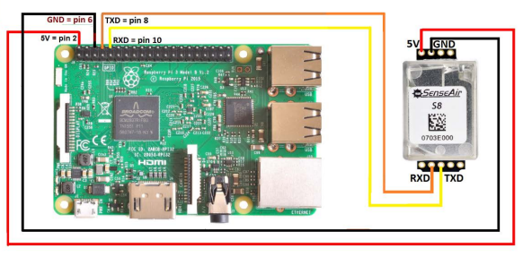

# SenseAir S8 CO2 Sensor with MQTT & Prometheus Integration

This project integrates the SenseAir S8 CO2 sensor with MQTT and Prometheus for monitoring and data collection. It enables real-time CO2 level monitoring and metrics collection through a Raspberry Pi setup.

## Requirements

### Hardware Requirements
- Raspberry Pi 4B (tested)
- SenseAir S8 CO2 Sensor
- USB to TTL converter or direct GPIO connection

## Connecting the Senseair S8 to your Raspberry Pi

Hook up the Senseair S8 to your Raspberry Pi using the following schematic:



Image source: http://co2meters.com/Documentation/AppNotes/AN168-S8-raspberry-pi-uart.pdf

### Software Requirements
- Raspberry Pi OS (tested)
- Docker and Docker Compose
- Python 3.x
- MQTT Broker
- Prometheus

### System Requirements
- Enable UART and disable bluetooth on Raspberry Pi by modifying `/boot/firmware/config.txt`:
  ```
  enable_uart=1
  dtoverlay=pi3-miniuart-bt
  dtoverlay=pi3-disable-bt
  ```
- Reboot

## Installation

1. Clone the repository:
   ```bash
   git clone https://github.com/ParinLL/SenseAir-S8-With-MQTT-Prometheus
   cd SenseAir-S8-With-MQTT-Prometheus
   ```

2. Create `.env` file:
   ```bash
   # MQTT Configuration
   MQTT_HOST=host.docker.internal
   MQTT_PORT=1883
   MQTT_TOPIC_PREFIX=sensors/co2

   # Serial Port Configuration
   SERIAL_PORT=/dev/ttyAMA0

   # Prometheus Configuration
   PROMETHEUS_PORT=9105
   ```

3. Docker Compose Configuration:
   ```yaml
   version: '3.8'

   services:
     s8-sensor:
       build:
         context: ./s8
         dockerfile: s8.Dockerfile
       devices:
         - ${SERIAL_PORT}:${SERIAL_PORT}  # Direct access to serial port
       ports:
         - "${PROMETHEUS_PORT}:${PROMETHEUS_PORT}"  # Prometheus metrics port
       env_file:
         - .env  # Load all environment variables from .env file
       volumes:
         - ./s8/s8.py:/app/s8.py  # Mount for development
       restart: always
       privileged: true  # Required for serial port access
       extra_hosts:
         - "host.docker.internal:host-gateway"  # Enable host.docker.internal on Linux
       networks:
         - sensor-network

   networks:
     sensor-network:
       driver: bridge
   ```

4. Build and start the container:
   ```bash
   # Build and run on Raspberry Pi
   docker compose up -d
   ```

## Usage

1. **Sensor Connection**
   - Connect the SenseAir S8 sensor to your Raspberry Pi using either:
     - USB to TTL converter
     - Direct GPIO pins (TX/RX)
   - Verify the connection using:
     ```bash
     ls /dev/tty*  # or your configured port
     ```

2. **Data Collection**
   - CO2 readings are automatically collected and published to MQTT
   - Data is scraped by Prometheus at configured intervals
   - Monitor metrics through Prometheus endpoint: `http://localhost:9105`

3. **Monitoring**
   - Access MQTT messages: Use any MQTT client to subscribe to the configured topic
   - View Prometheus metrics: Navigate to the Prometheus web interface
   - Grafana Dashboard:
     - A pre-configured dashboard is available in `monitoring/grafana-dashboard.json`
     - Dashboard features:
       - Current CO2 Level Gauge with color-coded thresholds (green < 1000ppm, yellow < 2000ppm, orange < 5000ppm, red >= 5000ppm)
       - CO2 Level History Graph showing trends over time
       - Current CO2 Classification Status (GREAT, NORMAL, SLEEPY, WARNING, ALERT)
       - CO2 Alerts Panel tracking alert history by severity
     - To import the dashboard:
       1. Access your Grafana instance
       2. Click the "+" icon in the sidebar and choose "Import"
       3. Upload the `grafana-dashboard.json` file or copy its contents
       4. Select your Prometheus data source
       5. The dashboard will auto-refresh every 10 seconds
    
    
    

## Application Details (s8.py)

### CO2 Level Classifications
```python
CO2_LEVELS = {
    'GREAT': (350, 450, 'Same as outdoor level'),
    'NORMAL': (451, 1000, 'Normal indoor level'),
    'SLEEPY': (1001, 2000, 'May cause drowsiness'),
    'WARNING': (2001, 5000, 'Warning level - Poor air quality'),
    'ALERT': (5001, float('inf'), 'ALERT - Dangerous level')
}
```

### MQTT Topics
1. **Online Status** (`sensors/co2/online`)
   - Value: "1" (online) or "0" (offline)
   - QoS: 1, Retained: True
   - Indicates sensor connectivity status

2. **Detection Status** (`sensors/co2/detected`)
   - Value: "NORMAL" (≤1000 ppm) or "ABNORMAL" (>1000 ppm)
   - QoS: 1, Retained: False
   - Indicates current air quality status

3. **CO2 Level** (`sensors/co2/level`)
   - Value: Current CO2 PPM reading
   - QoS: 1, Retained: False
   - Real-time CO2 concentration

4. **Peak Value** (`sensors/co2/peak`)
   - Value: Highest recorded CO2 PPM
   - QoS: 1, Retained: True
   - Historical peak tracking

### Prometheus Metrics
1. **CO2 Concentration**
   - Name: `co2_concentration_ppm`
   - Type: Gauge
   - Description: Current CO2 concentration in PPM

2. **CO2 Level Classification**
   - Name: `co2_level`
   - Type: Gauge with labels
   - Labels: GREAT, NORMAL, SLEEPY, WARNING, ALERT
   - Description: Current CO2 level classification

3. **CO2 Alerts**
   - Name: `co2_alerts_total`
   - Type: Counter with severity label
   - Description: Number of CO2 alerts by severity

### External Prometheus Integration

The `monitoring` directory contains configurations that allow an external Prometheus instance to scrape metrics from your Raspberry Pi. While the Raspberry Pi itself runs the sensor application directly (not in Kubernetes), these configurations enable integration with an external Kubernetes-based monitoring stack:

1. **Service Definition** (`monitoring/service.yaml`):
   ```yaml
   apiVersion: v1
   kind: Service
   metadata:
     name: s8-sensor
     namespace: kube-prometheus-stack
     labels:
       app: s8-sensor
   spec:
     type: ClusterIP
     ports:
       - name: metrics
         port: 9105
         targetPort: 9105
         protocol: TCP
   ```

2. **Endpoints Definition** (`monitoring/service.yaml`):
   ```yaml
   apiVersion: v1
   kind: Endpoints
   metadata:
     name: s8-sensor
     namespace: kube-prometheus-stack
     labels:
       app: s8-sensor
   subsets:
     - addresses:
         - ip: ${Raspberry Pi IP}  # Replace with your Raspberry Pi's IP
       ports:
         - name: metrics
           port: 9105
           protocol: TCP
   ```

3. **ServiceMonitor Definition** (`monitoring/servicemonitor.yaml`):
   ```yaml
   apiVersion: monitoring.coreos.com/v1
   kind: ServiceMonitor
   metadata:
     name: s8-sensor
     namespace: kube-prometheus-stack
     labels:
       app: s8-sensor
       prometheus: prometheus
   spec:
     selector:
       matchLabels:
         app: s8-sensor
     namespaceSelector:
       matchNames:
         - kube-prometheus-stack
     endpoints:
       - port: metrics
         interval: 10s
         path: /metrics
         targetPort: 9105
   ```

These configurations enable:
- Service discovery of your Raspberry Pi metrics endpoint
- Automatic scraping by Prometheus Operator (every 10 seconds)
- Integration with existing Kubernetes monitoring infrastructure

Note: These monitoring configurations are meant for external Prometheus instances running in Kubernetes that need to scrape metrics from your Raspberry Pi. The Raspberry Pi itself only runs the sensor application and exposes metrics.

### Error Handling
- Serial communication errors with troubleshooting suggestions
- MQTT connection retries with exponential backoff
- Automatic reconnection for both serial and MQTT
- Comprehensive logging with timestamps

### Features
- Real-time CO2 monitoring
- Automatic level classification
- Peak value tracking
- Health monitoring via online status
- Prometheus metrics for monitoring
- Last Will and Testament (LWT) for MQTT
- Configurable through environment variables

## Configuration

### MQTT Settings
- Broker: Configure in `.env`
- Topic Prefix: Default `sensors/co2`
- QoS: 1 (default)
- Automatic reconnection with retry logic

### Prometheus Settings
- Metrics Port: 9105 (default)
- Scrape Interval: 10s (configurable in ServiceMonitor)
- Metrics Path: `/metrics`

## Troubleshooting

1. **Serial Port Issues**
   - Verify UART is enabled in `/boot/firmware/config.txt`
   - Check permissions on serial port
   - Ensure correct port is configured in settings
   - Check if device is properly connected
   - Verify baud rate (9600)

2. **MQTT Connection**
   - Verify broker is running
   - Check network connectivity
   - Confirm credentials in `.env`
   - Check if host.docker.internal is resolving correctly

3. **Docker Issues**
   - Ensure privileged mode is enabled
   - Verify device mapping is correct
   - Check container logs: `docker compose logs -f s8-sensor`

4. **Prometheus Integration**
   - Verify Raspberry Pi IP is correctly set in endpoints.yaml
   - Ensure port 9105 is accessible from Prometheus server
   - Check Prometheus target status in dashboard
   - Verify ServiceMonitor is properly labeled for your Prometheus instance
   - Check if metrics endpoint is reachable: `curl http://<raspberry-pi-ip>:9105/metrics`

## Contributing

Contributions are welcome! Please feel free to submit a Pull Request.

## References

- [SenseAir S8 Python Library](https://github.com/ndoornekamp/senseair_s8) - Python library for interfacing with the SenseAir S8 CO2 sensor
